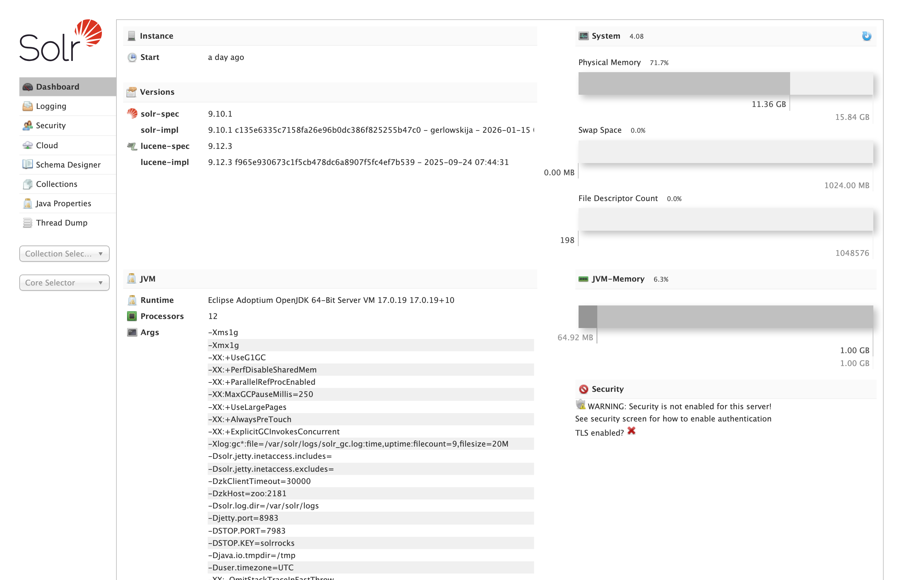
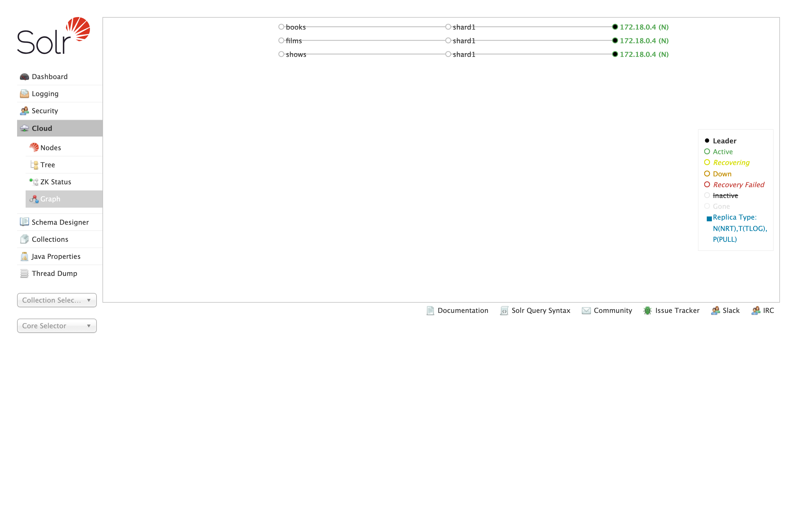
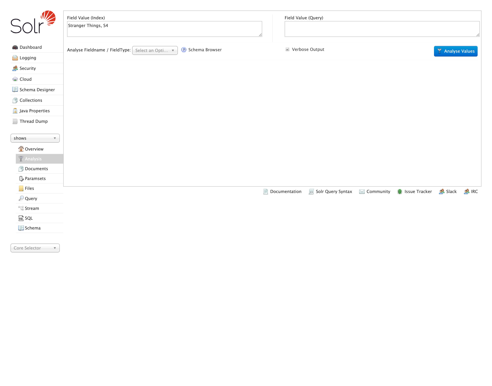

# Indexing

> **What this chapter covers and why it matters.** Indexing is where most production search problems are actually born — bad schemas, bad analysis chains, bad partial-update strategies, and risky reindexing patterns cause most of the relevance and performance fires you will fight. This chapter starts with the user-facing unit of data in Solr (the collection), then walks through schema design, field types, analyzers, SolrJ bulk indexing, the three flavors of partial update (full replace, atomic, in-place), zero-downtime reindexing patterns, and the commit model.
>
> **Prerequisites:** Chapter 1 — specifically §1.3 (the five data structures) and §1.4 (which structure each query type reads). You will not get the field-property tradeoffs without it.
>
> **You will learn:** How to design a Solr schema that you won't regret in six months, how the analyzer chain transforms text at index and query time, how to index from Java with SolrJ at production throughput, how to test against a real Solr with Testcontainers, when to use atomic vs. in-place updates and the trap of silently falling back, how to do zero-downtime reindexes with collection aliases, and how to think about commits.
>
> **What you should not skip:** §2.8 (partial updates — the single most misunderstood topic in production Solr) and §2.9 (reindexing — when you must, when you don't, and how).

## 2.0 Running Solr locally

Every example in this chapter assumes a Solr 10 server you can reach at `http://localhost:8983`. There are three reasonable ways to get one running on a developer laptop; pick the one that matches how you already work.

### Install paths

| Method | When to use | Command |
|---|---|---|
| **Docker** | You want a repeatable, isolated runtime — the default recommendation. | `docker run -p 8983:8983 apache/solr:10.0.0 solr-precreate shows` |
| **Homebrew (macOS)** | You want Solr managed alongside your other dev tools. | `brew install solr && brew services start solr` |
| **Archive** | You want to read the on-disk layout, edit `solr.in.sh`, or run on Linux without Docker. | Download from [solr.apache.org/downloads](https://solr.apache.org/downloads.html), then `bin/solr start -c` |

: Three install paths for a local Solr 10 server — Docker, Homebrew, and the binary archive — and when each one fits. {#tbl-02-install-paths}

The Docker image and the archive both default to `SOLR_HOME=/var/solr/data` (or the Linux equivalent). Homebrew uses `/opt/homebrew/var/lib/solr` on Apple Silicon. Know where it is — when an integration test misbehaves, the on-disk index is the source of truth.

### Starting Solr

In Solr 10, `bin/solr start` defaults to SolrCloud mode with an embedded ZooKeeper on port 9983 — perfect for development. Verify the cluster is up:

```bash
curl -s http://localhost:8983/solr/admin/info/system | jq .lucene.solr-spec-version
# → "10.0.0"
```

If that doesn't return `10.0.0`, check `solr-8983-console.log` in the Solr home directory. For multi-node tests, the [Testcontainers pattern in §2.7](#integration-testing-with-testcontainers) is usually simpler than running multiple `bin/solr` processes by hand.

### A tour of the admin UI

Solr ships with a web admin console at `http://localhost:8983/solr/`. You don't *need* it — every action it exposes is also a REST call — but in development it shortens many feedback loops. When you first land on the URL you get the Dashboard:

{#fig-02-admin-dashboard}

The tabs you'll actually use:

- **Cloud** — A live view of the cluster: nodes, collections, shards, replica states, and ZooKeeper contents. The Graph sub-view (@fig-02-admin-cloud-graph) is the fastest way to spot a replica stuck in `recovering` or `down`, and the Nodes sub-view exposes per-node CPU, heap, disk, and request rate.

{#fig-02-admin-cloud-graph}

- **Collections** — Create, delete, reload, and inspect collections. A form-driven UI over the Collections API (covered in §4.7).
- **Collection selector (left sidebar)** — Pick a collection (`shows`) and several per-collection tools open up:
  - **Schema** — Browse field definitions and field types, add new fields, see which `dynamicField` rule matched a given field. Editing here writes through the Schema API into `managed-schema.xml`.
  - **Query** — Run an ad-hoc `/select` request with `q`, `fq`, `fl`, `sort`, faceting, and debug (@fig-02-admin-query). The form translates to the URL shown above the result; copy that URL when you want to script the same query.

{#fig-02-admin-query}

  - **Analysis** — Type a value and see exactly which tokens come out of the index analyzer chain vs. the query analyzer chain (@fig-02-admin-analysis). We use this in §2.4 to walk through the `text_en` field.

{#fig-02-admin-analysis}

  - **Documents** — Add a single document via JSON, XML, or CSV. Handy for one-off testing.

> **Production tip — don't expose the admin UI to the public internet.** It's a development tool. In production, fence it off with a reverse proxy that requires authentication, or set `SOLR_OPTS="-Dsolr.disableAdminUI=true"` if you genuinely don't need it. The production observability stack lives in §4.13.

## 2.1 What is a collection?

A **collection** is Solr's user-facing unit of data. It is the thing you create, index documents into, query against, alias, back up, and delete. Everything you do as an application developer happens with respect to some collection.

The simplest accurate mental model: a collection is a **named, schema-bearing logical index**. "Products" is a collection. "User profiles" is a different collection. They have separate schemas, separate documents, and (almost always) separate query traffic.

```{mermaid}
%%| label: fig-02-collection-anatomy
%%| fig-cap: "The collection-shard-replica hierarchy: one logical collection maps to multiple shards, each backed by several replica copies of a Lucene index on disk."
flowchart LR
    APP[Your app] -->|index, query, update| COLL[Collection 'shows'<br/>logical index]
    COLL --> S1[Shard 1<br/>logical slice]
    COLL --> S2[Shard 2<br/>logical slice]
    S1 --> R1A[Replica<br/>Lucene index on disk]
    S1 --> R1B[Replica<br/>Lucene index on disk]
    S2 --> R2A[Replica<br/>Lucene index on disk]
    S2 --> R2B[Replica<br/>Lucene index on disk]
```

### What a collection is made of

A collection has four configured pieces:

1. **A schema.** The field definitions covered in §2.2. The schema lives in a configset.
2. **A configset.** A bundle of files — `managed-schema.xml`, `solrconfig.xml`, `synonyms.txt`, stopword files — stored in ZooKeeper, shared across the collection's replicas. Configsets can be shared across collections.
3. **A number of shards.** A shard is a logical horizontal slice of the collection; each document lives in exactly one shard, decided at index time by a router (default: a hash of the document's `id`). At small scale you have one shard. At large scale you have many.
4. **A number of replicas per shard.** A replica is a physical copy of a shard's data, hosted on some Solr node. Multiple replicas exist for fault tolerance and read throughput. Each replica is, under the hood, a single self-contained Lucene index — the kind we walked through in Chapter 1.

The chain is therefore: **collection → shards → replicas → Lucene index**. The collection is the only level you have to think about for routine work; shards and replicas only enter the picture once you scale, and that's Chapter 4's job.

### What's in a configset

The configset is the bundle of files that defines how a collection behaves. The same configset can back many collections, and in SolrCloud it lives in ZooKeeper under `/configs/<name>/`. The files you'll touch in this chapter:

| File | Purpose |
|---|---|
| `managed-schema.xml` | Field definitions, field types, `copyField`, `dynamicField`. Edited via the Schema API or admin UI (§2.2). |
| `solrconfig.xml` | Runtime tuning: request handlers, caches, the commit policy (§2.10), update-processor chain. |
| `synonyms.txt` | Synonym rules consumed by `SynonymGraphFilterFactory` (§2.4). Reload the collection after changing. |
| `stopwords.txt`, `protwords.txt` | Stopwords removed by `StopFilter` (§2.4); protected words kept verbatim by stemmers. |
| `lang/*.txt` | Per-language stopword and stemmer-exception files referenced by language-specific analyzers. |

: The files that live in a SolrCloud configset, what they configure, and the section of this chapter where you'll touch each one. {#tbl-02-configset-files}

Configset *management* — uploading with `bin/solr zk upconfig` or the [ConfigSets API](https://solr.apache.org/guide/solr/latest/configuration-guide/configsets-api.html), sharing across environments, versioning — is a SolrCloud topic and lives in §4.8.

### Cores vs replicas vs collections

A reliable source of confusion. Three terms, distinct levels:

- **Collection** — the logical thing your application talks to.
- **Replica** — one copy of one shard of a collection, living on one node.
- **Core** — the runtime container inside a Solr node that hosts one Lucene index. Each replica *is* a core on disk. The term is a holdover from Solr's pre-SolrCloud "standalone" days, when you ran cores directly without the collection abstraction.

In SolrCloud you create *collections* (which creates cores under the hood); in standalone mode you create *cores* directly. Solr 10 defaults to SolrCloud, so collections are what you'll work with.

### A minimal collection

In SolrCloud, you create a collection via the Collections API. From SolrJ:

```java
import org.apache.solr.client.solrj.request.CollectionAdminRequest;

CollectionAdminRequest.createCollection("shows", "shows_config", 2, 2)
    .process(client);
// args: collection name, configset name, numShards, numReplicas-per-shard
```

That command tells Solr: "create a collection called `shows`, use the `shows_config` configset (which must already exist in ZooKeeper), split it across 2 shards, and put 2 replicas of each shard somewhere in the cluster." Solr handles placement.

Equivalently from `bin/solr`:

```bash
bin/solr create -c shows -d shows_config -s 2 -rf 2
```

For a single-node dev cluster, `numShards=1` and `numReplicas=1` is fine. Production starts at 1 shard × 3 replicas for fault tolerance, and grows from there based on data size and traffic.

### When to use one collection vs. many

The single most common collection-design question: *should I put this in its own collection or use a field to distinguish it?*

**Use separate collections when:**

- The schemas would meaningfully differ (different field types, different analyzer chains, different language). Shows and user reviews almost always belong in separate collections.
- The query patterns are completely disjoint and you never join across them.
- The retention or lifecycle differs — daily playback events in time-routed collections, shows in a long-lived one.
- The security posture differs (one tenant's data must be physically isolatable).

**Use one collection with a discriminator field when:**

- The schemas are the same.
- You frequently query across the partitions ("show me all titles available on any platform in this region").
- The cardinality is high (one collection per user is almost never right; one collection per regional catalog sometimes is).

A pragmatic default: **start with one collection per "kind of thing" in your domain**, and handle the *environment* dimension with separate Solr clusters (dev / stage / prod) rather than env-suffixed collection names. The collection name stays `shows` in every environment; the parameter that changes is the cluster URL or ZooKeeper ensemble your client points at. Keeping the name stable means configset references, client code, dashboards, and reindex tooling don't have to be parameterised per environment, and it removes a class of "wrong collection in this env" mistakes. Reach for the discriminator-field pattern when one-collection-per-thing would explode collection count beyond a few dozen.

### What you can do without thinking about shards or replicas

For the rest of Chapter 2, you can treat a collection as a single logical index. Everything we cover — schema design, analyzers, indexing, partial updates, reindexing, commits — works the same whether the collection has 1 shard or 50, 1 replica or 6. The distributed plumbing only becomes relevant in Chapter 4.

## 2.2 Schema: the contract between your data and your index

A Solr collection has a **schema** that declares fields (`name`, `type`, properties) and field types (`text_general`, `pdate`, `pint`, etc.). Schemas come in two flavors:

- **Managed schema** (default since Solr 6, the only sensible choice today): edited via the Schema REST API or Admin UI; stored as `managed-schema.xml` in the configSet in ZooKeeper.
- **Classic `schema.xml`**: hand-edited file. Still legal but discouraged.
- **Schemaless mode**: fields are auto-created from the first document indexed. Convenient for prototyping; *avoid in production* because field type guessing produces surprises (e.g., `"01234"` becomes a number and loses its leading zero).

> **Production tip.** Start in managed-schema mode with schemaless **disabled**. Define every field deliberately. Schema drift is a real ops headache; making field creation explicit prevents it.

```{mermaid}
%%| label: fig-02-indexing-pipeline
%%| fig-cap: "End-to-end indexing pipeline from source data through SolrJ, analysis, and the in-RAM buffer to soft-commit visibility and hard-commit durability on disk."
flowchart LR
    A[Source data] --> B[SolrJ client]
    B --> C[UpdateRequestProcessor chain]
    C --> D[Schema-driven<br/>field analysis]
    D --> E[Analyzer chain<br/>tokens]
    E --> F[In-RAM segment buffer]
    F -- soft commit --> G[New IndexSearcher<br/>visible to queries]
    F -- hard commit --> H[Flush segment to disk<br/>roll tlog]
    H --> I[(.doc / .pos / .tim / .tip / .dvd / .fdt files)]
```

### Document granularity

Before you write a single field, decide what *one document* represents. For a shows catalog there are three reasonable answers:

| Granularity | Each document is… | Query patterns it serves well | Cost |
|---|---|---|---|
| **Show** | A whole TV show or movie | "find a show like Stranger Things"; faceting by genre, platform, year; collapse by franchise | One row per show — small index, simple ranking. Episode-level signals must be aggregated upstream of Solr. |
| **Episode** | A single episode | "find the episode where X happens"; per-episode descriptions and air dates | 10–100× more documents per show; show-level facets need a discriminator field or a roll-up query. |
| **Show with nested episodes** | A show document with episode child documents | Both of the above, in a single query | Higher write amplification on updates; the nested-document feature (§2.8) is more expensive than the flat alternatives. |

: Three document-granularity choices for a shows catalog — show, episode, or show-with-nested-episodes — with the query patterns each one serves well and the cost each one imposes. {#tbl-02-doc-granularity}

The pull is always toward finer granularity, because each new use case can be answered with a smaller, more specific document. The push back is that finer granularity multiplies your document count, your indexing throughput requirements, and the complexity of any query that has to aggregate back up.

A reasonable default: **pick the granularity that matches the unit your search result page renders.** If the result is a card showing a whole show, model a show as one document. If the result is an episode card, model an episode. Use nested documents only when the user genuinely needs *both* views from the same index and you've accepted the operational cost.

This decision is the hardest one to reverse cheaply. Changing field types or analyzer chains requires a reindex (§2.9); changing document granularity requires a reindex *and* a rewrite of every consuming query.

## 2.3 A concrete shows-catalog schema

```xml
<?xml version="1.0" encoding="UTF-8" ?>
<schema name="shows" version="1.7">

  <!-- ===== Field types ===== -->

  <fieldType name="string"  class="solr.StrField"   sortMissingLast="true" docValues="true"/>
  <fieldType name="boolean" class="solr.BoolField"  sortMissingLast="true"/>
  <fieldType name="pint"    class="solr.IntPointField"    docValues="true"/>
  <fieldType name="plong"   class="solr.LongPointField"   docValues="true"/>
  <fieldType name="pfloat"  class="solr.FloatPointField"  docValues="true"/>
  <fieldType name="pdouble" class="solr.DoublePointField" docValues="true"/>
  <fieldType name="pdate"   class="solr.DatePointField"   docValues="true"/>

  <!-- English text: tokenized, lowercased, stopworded, stemmed -->
  <fieldType name="text_en" class="solr.TextField" positionIncrementGap="100">
    <analyzer type="index">
      <tokenizer class="solr.StandardTokenizerFactory"/>
      <filter class="solr.EnglishPossessiveFilterFactory"/>
      <filter class="solr.LowerCaseFilterFactory"/>
      <filter class="solr.StopFilterFactory" words="lang/stopwords_en.txt" ignoreCase="true"/>
      <filter class="solr.SnowballPorterFilterFactory" language="English"/>
    </analyzer>
    <analyzer type="query">
      <tokenizer class="solr.StandardTokenizerFactory"/>
      <filter class="solr.EnglishPossessiveFilterFactory"/>
      <filter class="solr.LowerCaseFilterFactory"/>
      <filter class="solr.SynonymGraphFilterFactory" synonyms="synonyms.txt"
              ignoreCase="true" expand="true"/>
      <filter class="solr.StopFilterFactory" words="lang/stopwords_en.txt" ignoreCase="true"/>
      <filter class="solr.SnowballPorterFilterFactory" language="English"/>
    </analyzer>
  </fieldType>

  <!-- Dense vector field for semantic search (384-dim sentence embeddings) -->
  <fieldType name="knn_vector_384" class="solr.DenseVectorField"
             vectorDimension="384" similarityFunction="cosine"
             knnAlgorithm="hnsw" hnswMaxConnections="16" hnswBeamWidth="100"/>

  <!-- ===== Fields ===== -->

  <!-- Identity -->
  <field name="id"              type="string"  indexed="true"  stored="true"  required="true"/>

  <!-- Title in English-analyzed form for relevance scoring, plus a string mirror
       for exact sort/facet (filled via copyField below). -->
  <field name="title"           type="text_en" indexed="true"  stored="true"/>
  <field name="title_str"       type="string"  indexed="true"  stored="false" docValues="true"/>

  <!-- Original title (non-English shows, e.g. "Squid Game" / "오징어 게임"). Stored
       as a string so we can show it verbatim and facet on language groupings. -->
  <field name="original_title"  type="string"  indexed="true"  stored="true"  docValues="true"/>
  <field name="language"        type="string"  indexed="true"  stored="true"  docValues="true"/>

  <!-- Long synopsis. Analyzed for relevance and highlighting. -->
  <field name="description"     type="text_en" indexed="true"  stored="true"/>

  <!-- Catalog facets. All multi-valued + docValues so the JSON Facet API (§3.3)
       can aggregate them without an on-heap field cache. -->
  <field name="genres"          type="string"  indexed="true"  stored="true"  docValues="true" multiValued="true"/>
  <field name="platforms"       type="string"  indexed="true"  stored="true"  docValues="true" multiValued="true"/>
  <field name="creator"         type="string"  indexed="true"  stored="true"  docValues="true" multiValued="true"/>

  <!-- Cast: analyzed for searchability ("show me everything with Pedro Pascal")
       AND a string mirror for facet/sort. -->
  <field name="cast"            type="text_en" indexed="true"  stored="true"  multiValued="true"/>
  <field name="cast_str"        type="string"  indexed="true"  stored="false" docValues="true" multiValued="true"/>

  <!-- Numeric range/sort fields. -->
  <field name="release_year"    type="pint"    indexed="true"  stored="true"/>
  <field name="runtime_minutes" type="pint"    indexed="true"  stored="true"/>
  <field name="seasons"         type="pint"    indexed="true"  stored="true"/>
  <field name="rating"          type="pfloat"  indexed="true"  stored="true"/>
  <field name="status"          type="string"  indexed="true"  stored="true"  docValues="true"/>
                                <!-- "ongoing" | "ended" | "cancelled" | "limited" -->
  <field name="added_at"        type="pdate"   indexed="true"  stored="true"/>

  <!-- Hot counters / scores. These are the in-place-update targets (§2.8.2).
       indexed=false stored=false docValues=true is what unlocks the in-place path. -->
  <field name="popularity"      type="pfloat"  indexed="false" stored="false" docValues="true" multiValued="false"/>
  <field name="view_count"      type="plong"   indexed="false" stored="false" docValues="true" multiValued="false"/>

  <!-- Dense vector for semantic similarity ("dark crime drama in Scandinavia"). -->
  <field name="embedding"       type="knn_vector_384" indexed="true" stored="true"/>

  <!-- _version_ MUST be docValues=true (and indexed=false stored=false) for in-place
       updates to work (§2.8.2). The older "indexed=true stored=true" shape predates
       in-place updates and disables them silently. -->
  <field name="_version_"       type="plong"   indexed="false" stored="false" docValues="true"/>
  <field name="_root_"          type="string"  indexed="true"  stored="false" docValues="false"/>

  <uniqueKey>id</uniqueKey>

  <!-- copyField: feed title and cast into both their string mirrors (for exact
       facet/sort) and a catch-all text_all field (for default-q search). -->
  <copyField source="title"          dest="title_str"  maxChars="256"/>
  <copyField source="cast"           dest="cast_str"/>
  <copyField source="title"          dest="text_all"/>
  <copyField source="original_title" dest="text_all"/>
  <copyField source="description"    dest="text_all"/>
  <copyField source="cast"           dest="text_all"/>
  <copyField source="creator"        dest="text_all"/>

  <field name="text_all" type="text_en" indexed="true" stored="false" multiValued="true"/>

  <!-- dynamicField: convention for ad-hoc fields outside the main schema. -->
  <dynamicField name="*_s"  type="string"  indexed="true" stored="true"/>
  <dynamicField name="*_i"  type="pint"    indexed="true" stored="true"/>
  <dynamicField name="*_dt" type="pdate"   indexed="true" stored="true"/>

</schema>
```

### A canonical seed dataset

Every example in the rest of this book — every query, every facet, every signals row in Chapter 5 — draws from a small fixed set of shows. Pin this table in your head; it makes the examples concrete.

| `id` | `title` | `platforms` | `genres` | `release_year` | `status` |
|---|---|---|---|---|---|
| `ST-001` | Stranger Things | Netflix | sci-fi, horror, drama | 2016 | ongoing |
| `BB-001` | Breaking Bad | Netflix | crime, drama, thriller | 2008 | ended |
| `BCS-001` | Better Call Saul | Netflix | crime, drama, legal | 2015 | ended |
| `TC-001` | The Crown | Netflix | drama, historical | 2016 | ended |
| `WED-001` | Wednesday | Netflix | supernatural, comedy, mystery | 2022 | ongoing |
| `SG-001` | Squid Game | Netflix | thriller, drama, korean | 2021 | ongoing |
| `BRG-001` | Bridgerton | Netflix | romance, period, drama | 2020 | ongoing |
| `OZ-001` | Ozark | Netflix | crime, drama | 2017 | ended |
| `TBR-001` | The Bear | Hulu | drama, comedy, food | 2022 | ongoing |
| `OMITB-001` | Only Murders in the Building | Hulu | comedy, mystery | 2021 | ongoing |
| `SH-001` | Shōgun | Hulu | drama, historical, japanese | 2024 | limited |
| `TBY-001` | The Boys | Prime Video | superhero, satire, action | 2019 | ongoing |
| `RCH-001` | Reacher | Prime Video | action, thriller, crime | 2022 | ongoing |
| `FB-001` | Fleabag | Prime Video | comedy, drama, british | 2016 | ended |
| `SVR-001` | Severance | Apple TV+ | sci-fi, mystery, thriller | 2022 | ongoing |
| `TL-001` | Ted Lasso | Apple TV+ | comedy, drama, sports | 2020 | ended |
| `TM-001` | The Mandalorian | Disney+ | sci-fi, western, action | 2019 | ongoing |
| `LK-001` | Loki | Disney+ | sci-fi, fantasy, drama | 2021 | ongoing |
| `AND-001` | Andor | Disney+ | sci-fi, drama, political | 2022 | ongoing |
| `TLOU-001` | The Last of Us | Max | drama, post-apocalyptic, horror | 2023 | ongoing |
| `HOTD-001` | House of the Dragon | Max | fantasy, drama, action | 2022 | ongoing |
| `SUC-001` | Succession | Max | drama, satire | 2018 | ended |
| `WW-001` | Westworld | Max | sci-fi, western, drama | 2016 | cancelled |
| `BM-001` | Black Mirror | Netflix | sci-fi, anthology, thriller | 2011 | ongoing |
| `PB-001` | Peaky Blinders | Netflix | crime, period, british | 2013 | ended |
| `MH-001` | Mindhunter | Netflix | crime, psychological, drama | 2017 | cancelled |
| `WT-001` | The Witcher | Netflix | fantasy, action, adventure | 2019 | ongoing |
| `YS-001` | Yellowstone | Peacock | drama, western | 2018 | ended |
| `TO-001` | The Office (US) | Peacock | comedy, sitcom | 2005 | ended |
| `FLG-001` | The Office (UK) | BritBox | comedy, sitcom | 2001 | ended |

: The 30-show seed catalog every example in the rest of the book draws from, spanning 8 platforms, ~20 genres, mixed languages, and a mix of ongoing, ended, and cancelled status. {#tbl-02-seed-catalog}

That's 30 shows across 8 platforms, ~20 distinct genres, English and non-English titles (`Shōgun`, `Squid Game`), running and ended status, and franchise relationships (`TM-001`, `LK-001`, `AND-001` all share the Star Wars / Marvel cinematic universe — useful for the `relatedness()` aggregation in §5.5).

Some examples below will refer to these specific IDs. The two pairs `TO-001` / `FLG-001` (US vs. UK *Office*) and the `MH-001` / `BB-001` near-collisions on prefix `b*` are intentional — they let us demonstrate disambiguation, prefix-query cost, and editorial overrides (§5.6) on realistic data.

### Field properties decoded

| Property | What it does | Cost |
|---|---|---|
| `indexed=true` | Add to inverted index → field is searchable | Write throughput, disk |
| `stored=true` | Keep verbatim copy → returnable in `fl` | Disk; large strings hurt |
| `docValues=true` | Column-stride forward index → fast sort/facet/function queries | Disk |
| `multiValued=true` | Field can hold many values per doc | Position gap inserted between values |
| `required=true` | Doc rejected if field is missing | n/a |

: The five schema field properties, what each one enables on a field, and the storage or write cost it adds. {#tbl-02-field-properties}

**Rules of thumb you should internalize**:

1. **Text you want to *search*** → `indexed=true`, `stored=true` (for highlighting), in a `text_*` field type.
2. **Text you want to *sort, facet, or filter exactly*** → `string` field with `docValues=true`. Either separate the field, or `copyField` a tokenized version into a `string` mirror (`title` → `title_str`).
3. **Numerics/dates you want to range-query and sort** → the `solr.*PointField` types with `docValues=true`.
4. **Anything you ever return in `fl`** → `stored=true` *or* `useDocValuesAsStored=true` for primitive types.

> **Production tip — `docValues` is almost always worth the disk.** Without it, sorting on a text field happens via on-heap field cache reconstruction; with it, sorting is a column read from mmap. Sort, facet, function-query, and grouping all collapse to docValues.

## 2.4 Analyzers, tokenizers, filters

A text field type has an **analyzer chain** at index time and (optionally) a different one at query time. The chain is:

`Tokenizer → Filter → Filter → ...`

For our `text_en` above, indexing the title `"Stranger Things Season 4"` flows:

```{mermaid}
%%| label: fig-02-analyzer-chain
%%| fig-cap: "The text_en analyzer chain transforming 'Stranger Things Season 4' through tokenization, lower-casing, stop filtering, and Porter stemming."
flowchart LR
    A["Stranger Things Season 4"]
    A --> B[StandardTokenizer]
    B --> C["Stranger, Things, Season, 4"]
    C --> D[EnglishPossessiveFilter]
    D --> E["Stranger, Things, Season, 4"]
    E --> F[LowerCaseFilter]
    F --> G["stranger, things, season, 4"]
    G --> H[StopFilter]
    H --> I["stranger, things, season, 4"]
    I --> J[SnowballPorter English]
    J --> K["stranger, thing, season, 4"]
```

A query for `Strange Things` goes through the same kind of pipeline (plus synonyms at query time) and reduces to `[strang, thing]`. Note: Porter stems `strange → strang` but leaves `stranger → stranger`. They do *not* collapse to the same root, which is one reason exact phrase matches are stronger signals than individual-token AND.

> **Production tip — keep index and query analyzers symmetric, except for synonym expansion.** Doing synonym expansion at index time bakes the synonym set into the index and forces a reindex when you change `synonyms.txt`. Doing it at query time only requires reloading the collection. Use `SynonymGraphFilterFactory` (not the legacy `SynonymFilterFactory`) so multi-word synonyms compose correctly with phrase queries.

### Testing analyzer chains with the Analysis form

The fastest way to verify a chain does what you think it does is the admin UI's **Analysis** tab (introduced in the tour in §2.0). Pick the collection, pick a field name or field type, paste a value into the *Index Analyzer* box (and optionally a different value into the *Query Analyzer* box to compare), and click *Analyze Values*.

For our `text_en` field, indexing `"Stranger Things, S4"` produces the following step-by-step breakdown — one row per stage in the chain:

| Stage | Output tokens |
|---|---|
| `StandardTokenizer` | `Stranger`, `Things`, `S4` (comma dropped as punctuation) |
| `EnglishPossessiveFilter` | `Stranger`, `Things`, `S4` (no change — no possessive) |
| `LowerCaseFilter` | `stranger`, `things`, `s4` |
| `StopFilter` | `stranger`, `things`, `s4` (none of these are stopwords) |
| `SnowballPorter` (English) | `stranger`, `thing`, `s4` (Porter strips the plural `-s` from `things`) |

: Step-by-step output of the `text_en` analyzer chain when indexing the string `"Stranger Things, S4"`, as seen in the admin UI Analysis tab. {#tbl-02-analysis-walkthrough}

A query for `"Strange Things"` flows through the same chain (plus any query-time synonym expansion) and reduces to `[strang, thing]`. Both forms share `thing`, so documents will match on that token; the `strange/stranger` divergence is why the exact-phrase boost in §3.2 matters.

When a search fails to return what you expect, the Analysis tab is the first place to look: it shows you what the index actually contains versus what your query actually produced, without having to read tokenized output from a `debug=true` parameter.

> **Production tip — bookmark the Analysis endpoint.** The form posts to `/solr/<collection>/analysis/field?wt=json&analysis.fieldvalue=<input>&analysis.fieldtype=<type>`. Curl that endpoint from CI to assert an analyzer change actually produced the intended tokens — a 10-line regression test for the kind of schema drift that's painful to debug after the fact.

## 2.5 `copyField` and `dynamicField`

- **`copyField`** routes a field's content into one or more additional fields *during indexing*. The classic use is a single `text_all` field that aggregates `title`, `description`, `cast`, `creator`, etc. (the schema above does this), so that a default `q=` searches everywhere. Another classic use is shadow `string` fields for sorting/faceting — note how `title` → `title_str` and `cast` → `cast_str` in our schema.
- **`dynamicField`** matches by suffix/prefix wildcard. `*_s` means "any field whose name ends in `_s` is automatically a string". Useful for multi-tenant or rapidly-evolving data where you don't want to declare every field. Pattern: `network_region_s`, `imdb_id_s`, `last_aired_dt`.

## 2.6 SolrJ: indexing from Java

For Solr 10, the Maven coordinates are:

```xml
<dependency>
  <groupId>org.apache.solr</groupId>
  <artifactId>solr-solrj</artifactId>
  <version>10.0.0</version>
</dependency>
<!-- For Jetty-based clients (HttpJettySolrClient, ConcurrentUpdateJettySolrClient, etc. — also used by the default CloudSolrClient when Jetty is on the classpath) -->
<dependency>
  <groupId>org.apache.solr</groupId>
  <artifactId>solr-solrj-jetty</artifactId>
  <version>10.0.0</version>
</dependency>
```

The Solr 10 reference guide states verbatim: *"If you want to use Jetty-based HTTP clients (HttpJettySolrClient, ConcurrentUpdateJettySolrClient, LBJettySolrClient, or CloudJettySolrClient), you need to add the maven dependency solr-solrj-jetty."* Alternatively, *"you can use HttpJdkSolrClient from the base solr-solrj artifact, which uses Java's built-in HTTP client and has no additional dependencies."* The split into multiple artifacts is the result of SOLR-17161 in the 9.x line; further artifacts include `solr-solrj-zookeeper` (only needed if you really must speak ZooKeeper from the client) and `solr-solrj-streaming` (Streaming Expressions).

> **Solr 9 difference — single SolrJ artifact.** In Solr 9.x (before SOLR-17161 landed late in the cycle), there was a single `solr-solrj` artifact that pulled in Jetty, ZooKeeper, and streaming transitively. If you're upgrading a 9.x build script, expect to add `solr-solrj-jetty` (or switch to `HttpJdkSolrClient`) and possibly `solr-solrj-zookeeper`.

> **Production tip — Solr 10 SolrJ runs on Java 17.** The *server* requires Java 21 (per the Solr 10 upgrade notes: *"Solr 10.0 requires at least Java 21, while SolrJ 10.0 requires at least Java 17"*), but the *client* library only requires Java 17. Java 17 client applications can still talk to a Solr 10 cluster.

### Connecting to SolrCloud

In Solr 10, the recommended pattern is to connect via Solr node URLs, not directly to ZooKeeper. The Solr 9.x line deprecated `CloudSolrClient.Builder`'s ZooKeeper-hosts constructor; the 10.x guidance is to give the client a list of Solr base URLs.

```java
import org.apache.solr.client.solrj.impl.CloudSolrClient;
import org.apache.solr.client.solrj.SolrClient;
import java.time.Duration;
import java.util.List;

public class SolrFactory {
    public static SolrClient build() {
        List<String> solrUrls = List.of(
            "http://solr-0.solr-headless.solr.svc.cluster.local:8983/solr",
            "http://solr-1.solr-headless.solr.svc.cluster.local:8983/solr",
            "http://solr-2.solr-headless.solr.svc.cluster.local:8983/solr"
        );
        return new CloudSolrClient.Builder(solrUrls)
            .withDefaultCollection("shows")
            .withConnectionTimeout(Duration.ofSeconds(10))
            .withRequestTimeout(Duration.ofSeconds(30))
            .build();
    }
}
```

Hold the client as a long-lived singleton in your application — it's thread-safe and expensive to construct. Close it on shutdown.

> **Solr 9 difference — ZooKeeper host constructor.** In Solr 9.x, `new CloudSolrClient.Builder(zkHosts, Optional.of(chroot))` was the common idiom: the client connected directly to ZooKeeper. That constructor was deprecated in 9.x and the Solr 10 recommendation is to pass Solr base URLs as shown above (the client discovers the cluster via the Solr nodes themselves). If you absolutely must speak ZK from the client, add `solr-solrj-zookeeper` and use the ZK-host constructor — but the URL-list form is the future and is what works in production without the extra dependency.
>
> Also in Solr 10, the `Major Changes` page notes: *"CloudHttp2SolrClient.Builder has moved to CloudSolrClient; users should generally have no need to refer to CloudHttp2SolrClient or any class/member with 'http2' in it. The builder will check if Jetty HttpClient is available and use that, otherwise fallback on a JDK based HttpClient."* For new code in Solr 10, prefer `CloudSolrClient.Builder` directly. The `CloudHttp2SolrClient` symbol still exists for source compatibility but is effectively an alias.

### Indexing a single document

```java
import org.apache.solr.common.SolrInputDocument;
import org.apache.solr.client.solrj.SolrClient;

SolrInputDocument doc = new SolrInputDocument();
doc.addField("id",              "ST-001");
doc.addField("title",           "Stranger Things");
doc.addField("description",
    "When a young boy vanishes, a small town uncovers a mystery involving "
  + "secret government experiments, supernatural forces, and one strange little girl.");
doc.addField("genres",          List.of("sci-fi", "horror", "drama"));
doc.addField("platforms",       List.of("Netflix"));
doc.addField("creator",         List.of("The Duffer Brothers"));
doc.addField("cast",            List.of("Millie Bobby Brown", "Finn Wolfhard",
                                        "Winona Ryder", "David Harbour"));
doc.addField("release_year",    2016);
doc.addField("runtime_minutes", 51);
doc.addField("seasons",         4);
doc.addField("rating",          8.7f);
doc.addField("status",          "ongoing");
doc.addField("added_at",        java.time.Instant.now().toString());
doc.addField("embedding",       List.of(0.012f, -0.183f, /* ... 384 dims ... */ 0.044f));
// popularity and view_count are in-place-updated by the signals pipeline (Chapter 5);
// don't set them at initial-index time.

client.add("shows", doc);
client.commit("shows"); // For demos only; see commit-strategies section.
```

### Bulk indexing throughput

For real ingestion pipelines do **not** call `client.add(doc)` in a loop per document. Two patterns dominate:

1. **Batched `add(Collection<SolrInputDocument>)` on `CloudSolrClient`** — gives you back-pressure and exceptions.
2. **`ConcurrentUpdateJettySolrClient`** (Solr 10) — fire-and-forget with internal queues and parallel HTTP. Highest throughput; you must implement an error handler because exceptions surface asynchronously.

```java
import org.apache.solr.client.solrj.impl.ConcurrentUpdateJettySolrClient;

try (ConcurrentUpdateJettySolrClient client =
        new ConcurrentUpdateJettySolrClient.Builder(
                "http://solr-0:8983/solr/shows")
            .withQueueSize(10_000)
            .withThreadCount(8)
            .build()) {

    List<SolrInputDocument> batch = new ArrayList<>(1_000);
    for (Show s : shows) {
        batch.add(toSolrDoc(s));
        if (batch.size() == 1_000) {
            client.add(batch);
            batch.clear();
        }
    }
    if (!batch.isEmpty()) client.add(batch);
    client.blockUntilFinished(); // wait for the internal queue to drain
}
```

> **Solr 9 difference — `ConcurrentUpdateHttp2SolrClient`.** In Solr 9.x, the equivalent class was `ConcurrentUpdateHttp2SolrClient` (note the `Http2` in the name). Solr 10 (SOLR-18005) refactored this: the old class was made abstract and renamed `ConcurrentUpdateBaseSolrClient`, with `ConcurrentUpdateJettySolrClient` added as the new Jetty-backed concrete implementation. If you're upgrading from 9, replace the symbol name; the API surface is essentially the same.

For the typical case (a Java service indexing through SolrCloud) prefer `CloudSolrClient` batches — it routes documents to the correct shard leader directly, avoiding the inter-node hop that `ConcurrentUpdateJettySolrClient` against a single endpoint introduces.

> **Production tip — set `withQueueSize` deliberately.** Too small and threads stall on the bounded queue. Too large and a node failure leaves thousands of in-flight docs to recover. 5k–20k is a typical sweet spot. Monitor with the Solr metrics endpoint (`UPDATE.updateHandler.adds`).

### Atomic and partial updates: a teaser

SolrJ also supports **atomic updates** — modify a single field without resending the whole document — and **in-place updates**, which skip reindexing entirely. These are important enough to deserve their own section: see §2.8 below.

## 2.7 Integration testing with Testcontainers

### What it is

[Testcontainers](https://testcontainers.com) is a Java library that spins up real Docker containers inside your JUnit or TestNG tests and tears them down automatically when the test suite finishes. The `solr` module provides a `SolrContainer` that starts the official `apache/solr` Docker image, exposes the Solr port, and gives you a ready-to-use `SolrClient` — the same client you use in production.

> **Why not an embedded Solr?** There is no supported embedded Solr in Solr 10. The old `EmbeddedSolrServer` still compiles but is undocumented, untested for correctness, and missing SolrCloud semantics. The Solr project's own recommendation is to test against a real Solr instance. Testcontainers is how you do that without a shared dev cluster.

### The official Docker image

The official image is [`apache/solr`](https://hub.docker.com/r/apache/solr) on Docker Hub. Tags follow Solr releases: `apache/solr:10.0.0`, `apache/solr:9.8`, `apache/solr:latest`. The Solr Admin UI is available on port 8983 — useful for poking at a running container while debugging a test.

> **Admin UI for debugging.** When a test is failing and you want to inspect the index, add a `Thread.sleep(300_000)` breakpoint, connect to `http://localhost:<mappedPort>/solr`, and use the **Analysis** tab (to trace how a string is tokenized), the **Query** tab (to run ad-hoc queries), and the **Schema** tab (to inspect field definitions). It's the fastest way to diagnose analyzer chain or schema issues without writing more test code. See the [Solr Admin UI reference](https://solr.apache.org/guide/solr/latest/deployment-guide/solr-admin-ui.html) for the full tour.

### Maven dependency

```xml
<dependency>
  <groupId>org.testcontainers</groupId>
  <artifactId>solr</artifactId>
  <version>1.20.4</version>
  <scope>test</scope>
</dependency>
<!-- JUnit 5 integration -->
<dependency>
  <groupId>org.testcontainers</groupId>
  <artifactId>junit-jupiter</artifactId>
  <version>1.20.4</version>
  <scope>test</scope>
</dependency>
```

### A minimal integration test

```java
import org.apache.solr.client.solrj.SolrClient;
import org.apache.solr.client.solrj.impl.CloudSolrClient;
import org.apache.solr.client.solrj.request.CollectionAdminRequest;
import org.apache.solr.client.solrj.response.QueryResponse;
import org.apache.solr.client.solrj.request.SolrQuery;
import org.apache.solr.common.SolrInputDocument;
import org.junit.jupiter.api.*;
import org.testcontainers.containers.SolrContainer;
import org.testcontainers.junit.jupiter.Container;
import org.testcontainers.junit.jupiter.Testcontainers;
import org.testcontainers.utility.DockerImageName;

import java.util.List;

@Testcontainers
class ProductIndexTest {

    @Container
    static SolrContainer solr = new SolrContainer(
            DockerImageName.parse("apache/solr:10.0.0"))
        .withCollection("shows");    // creates the collection on startup

    private SolrClient client;

    @BeforeEach
    void setUp() throws Exception {
        // SolrContainer exposes the standard Solr port on a random host port
        String url = "http://" + solr.getHost() + ":" + solr.getSolrPort() + "/solr";
        client = new CloudSolrClient.Builder(List.of(url))
            .withDefaultCollection("shows")
            .build();
    }

    @AfterEach
    void tearDown() throws Exception {
        client.close();
    }

    @Test
    void indexAndQuery() throws Exception {
        // Index a document
        SolrInputDocument doc = new SolrInputDocument();
        doc.addField("id",           "ST-001");
        doc.addField("title",        "Stranger Things");
        doc.addField("platforms",    "Netflix");
        doc.addField("release_year", 2016);
        client.add(doc);
        client.commit();

        // Query it back
        QueryResponse resp = client.query(
            new SolrQuery("title:Stranger").setRows(10));

        Assertions.assertEquals(1, resp.getResults().getNumFound());
        Assertions.assertEquals("ST-001",
            resp.getResults().get(0).getFieldValue("id"));
    }
}
```

A few things worth noting:

- **`@Container` + `static`** — a static container is shared across all tests in the class and started once. Drop `static` if you need a clean Solr per test (slower but fully isolated).
- **`withCollection("shows")`** — creates a collection using Solr's default configset. To use a custom configset, mount it into the container with `.withSolrConfiguration("configsetName", path)` — see the [Testcontainers Solr docs](https://java.testcontainers.org/modules/solr/).
- **`getSolrPort()`** returns the *mapped* host port, which is random. Testcontainers handles the Docker port mapping; you never hardcode 8983 in tests.
- **Commit is required.** The container runs with the same commit defaults as a real Solr. Either call `client.commit()` explicitly after indexing in tests, or configure the container's `solrconfig.xml` with a short `autoSoftCommit` interval.

> **Production tip — one container per test class, shared.** Container startup is the expensive part (3–8 seconds for Solr). Use `@Container static` and `@TestMethodOrder` to keep the container alive across all tests. If test isolation requires a clean index, call `client.deleteByQuery("shows", "*:*")` + `client.commit()` in `@BeforeEach` rather than restarting the container.

> **Production tip — pin the image version.** `apache/solr:latest` will silently pull a newer Solr on the next `docker pull`, which can break tests when APIs change. Pin to `apache/solr:10.0.0` (or whatever minor you're targeting) in CI, and update deliberately.

## 2.8 Partial updates: atomic, in-place, and when they fall back

Once your index is bootstrapped, almost all write traffic in a production Solr deployment falls into one of three buckets:

1. **Full document replacement.** You send the entire document; Solr discards the old version and reindexes it.
2. **Atomic update.** You send only the fields you want to change, marked with modifier maps (`set`, `add`, `inc`, …). Under the hood Solr still reindexes the whole document — you just didn't have to assemble it on the client side.
3. **In-place update.** Same syntax as an atomic update, but on fields that meet a strict set of constraints Solr rewrites only the docValues column. The document is *not* reindexed. This is the only path that is genuinely "partial" at the Lucene level.

Optimistic concurrency (the `_version_` field) is **orthogonal** to all three — you can layer it on any update.

```{mermaid}
%%| label: fig-02-partial-update-dispatch
%%| fig-cap: "Decision tree for partial-update dispatch: how Solr chooses between full replacement, in-place docValues rewrite, and a fallback atomic reindex."
flowchart TD
    A[Client sends update] --> B{Document includes<br/>modifier maps?<br/>set/add/inc/…}
    B -- No --> C[Full replacement]
    C --> D[Reindex whole doc]
    B -- Yes --> E{All touched fields<br/>meet in-place criteria?<br/>numeric · docValues only ·<br/>single-valued · not indexed ·<br/>not stored}
    E -- Yes --> F[In-place update<br/>rewrite docValues only]
    E -- No --> G[Atomic update]
    G --> H[Fetch existing doc,<br/>apply modifiers,<br/>reindex whole doc]
    D --> Z[Commit]
    F --> Z
    H --> Z
```

> **Production tip — atomic ≠ cheap.** The single most common mistake is thinking atomic updates are partial at the Lucene level. They aren't. If a 50-field document gets an `inc` on one counter, Solr rebuilds and reindexes all 50 fields, runs every analyzer, and replaces the underlying Lucene document. For genuinely hot fields, plan for in-place.

### 2.8.1 Atomic updates

#### Supported modifiers

| Modifier       | Field shape          | Behavior |
|----------------|----------------------|----------|
| `set`          | any                  | Replace value(s). `null` or `[]` removes the field. |
| `add`          | multi-valued         | Append value(s). |
| `add-distinct` | multi-valued         | Append value(s) only if not already present. |
| `remove`       | multi-valued         | Remove all occurrences of the given value(s). |
| `removeregex`  | multi-valued         | Remove values matching a regex. |
| `inc`          | numeric, single-val. | Increment (negative argument decrements). |

: The six atomic-update modifiers Solr supports, the field shape each requires, and what the operation does to the existing values. {#tbl-02-atomic-modifiers}

These are the only six. Anything else — rename a field, concatenate strings, derive a value — has to be done client-side via a read-modify-write with a full replace.

#### Schema requirements

From the Solr 10 reference guide: every "real" field your application populates must be `stored="true"` OR `docValues="true"`. Solr reconstructs the document from one of those. The exception is `copyField` destinations, which must **not** be stored and must not behave as if stored (`useDocValuesAsStored="false"`), otherwise on each atomic update Solr would double-write — once from the source-field copy and once from the existing stored destination value — producing duplicate or stale tokens.

If any required field violates these rules, the entire atomic update fails. There is no partial recovery.

#### How atomic updates actually work

```{mermaid}
%%| label: fig-02-atomic-update-sequence
%%| fig-cap: "How an atomic update actually executes on the shard leader: read existing doc, merge modifiers, re-run analyzers, reindex the whole Lucene document, then forward to replicas."
sequenceDiagram
    participant App as Client (SolrJ)
    participant Leader as Shard Leader
    participant TLog as Transaction Log
    participant Index as Lucene Index
    App->>Leader: doc with {id, "field":{"set":"new"}}
    Leader->>TLog: Look up id (Real-Time Get)
    TLog-->>Leader: Latest in-flight doc if any
    Leader->>Index: Otherwise fetch stored fields
    Index-->>Leader: Existing doc
    Leader->>Leader: Merge modifiers into full doc
    Leader->>Leader: Re-run analyzers on every field
    Leader->>TLog: Append new full doc
    Leader->>Index: Index new Lucene doc<br/>(old marked deleted)
    Leader-->>App: 200 OK
    Leader->>Replicas: Forward merged full doc
```

Three things follow from this:

1. **Atomic ≠ partial at the Lucene level.** Lucene has no concept of mutating a doc; the new doc is added and the old one is logically deleted. Segment merges reclaim the space later.
2. **All analyzers run again on every field.** Heavy stem chains or synonym graph filters cost the same whether you set one field or twenty.
3. **The merge happens on the shard leader before forwarding to replicas.** Replicas see the merged full document, not the modifier instructions.

#### Practical SolrJ helper

Wrap the modifier-map ceremony so app code stays readable:

```java
public final class AtomicOp {
    public static Map<String,Object> set(Object v)         { return Collections.singletonMap("set", v); }
    public static Map<String,Object> setNull()             { return Collections.singletonMap("set", null); }
    public static Map<String,Object> inc(Number delta)     { return Map.of("inc", delta); }
    public static Map<String,Object> add(Object v)         { return Map.of("add", v); }
    public static Map<String,Object> addDistinct(Object v) { return Map.of("add-distinct", v); }
    public static Map<String,Object> remove(Object v)      { return Map.of("remove", v); }
    public static Map<String,Object> removeRegex(String r) { return Map.of("removeregex", r); }
}
```

A typical update reads cleanly:

```java
SolrInputDocument doc = new SolrInputDocument();
doc.addField("id", "ST-001");
doc.addField("rating",     AtomicOp.set(8.9f));               // bump rating after new season
doc.addField("view_count", AtomicOp.inc(1));                  // hot counter (§2.8.2)
doc.addField("platforms",  AtomicOp.addDistinct("Hulu"));     // newly licensed to Hulu
doc.addField("status",     AtomicOp.set("ended"));            // show wrapped
client.add("shows", doc);
```

#### Common gotchas

- **`copyField` and destinations.** If you ever stored data directly into a copyField destination (a common bootstrap mistake), atomic updates will silently lose it — only what came in via copyField sources is reconstructed. Make destinations `stored="false"`.
- **`set` on multi-valued.** Accepts a list, replaces the entire list. `set(null)` or `set([])` clears it.
- **`inc` on a missing field.** Treated as starting from zero. Safe for "first view" counters.
- **Boolean / date fields.** `set` works; `inc` does not. To toggle a boolean you must read it and write the negation.

### 2.8.2 In-place updates: the genuinely partial path

#### What they are

An in-place update is what you actually want for a counter, popularity score, rating, or "last seen" timestamp. The Solr 10 reference guide is direct: *"only the fields to be updated are affected and the rest of the documents are not reindexed internally. Hence, the efficiency of updating in-place is unaffected by the size of the documents that are updated."*

Concretely: Solr rewrites the docValues column for the affected field on the live segment, without producing a new Lucene document. No analyzer run, no copyField re-evaluation, no full document round-trip from the transaction log.

#### When Solr picks the in-place path

Solr decides at request time, per field. **All** of the following must hold:

1. The field is **numeric** (e.g. `pint`, `plong`, `pfloat`, `pdouble`, `pdate`).
2. The field has `indexed="false"`, `stored="false"`, `multiValued="false"`, `docValues="true"`.
3. The `_version_` field itself has the same shape (the default in modern Solr).
4. Any copyField destinations from the updated field also satisfy the above.
5. The modifier is `set` or `inc`.

If *any* of those is violated, Solr **silently falls back** to a regular atomic update — same response, very different cost. That silent fallback is the trap.

> **Production tip — fail fast with `update.partial.requireInPlace=true`.** Solr 10 lets you set this request parameter; if the update can't be done in-place the request fails instead of silently falling back. Use this on hot counter paths in your CI tests — the day someone "helpfully" adds `stored="true"` to your counter field, the build breaks instead of production performance.

#### Schema pattern for counters

```xml
<field name="view_count"  type="plong"  indexed="false" stored="false" docValues="true" multiValued="false"/>
<field name="popularity"  type="pfloat" indexed="false" stored="false" docValues="true" multiValued="false"/>
<field name="last_watched" type="pdate" indexed="false" stored="false" docValues="true" multiValued="false"/>
```

These are **sortable**, **facetable**, and usable in **function queries** (`boost=popularity`). They are *not* matchable in text queries. Almost always the right trade-off for view-count and recency-style data on a shows catalog.

#### SolrJ example with the safety net

```java
import org.apache.solr.client.solrj.request.UpdateRequest;

public void bumpViewCount(SolrClient client, String docId) throws Exception {
    SolrInputDocument doc = new SolrInputDocument();
    doc.addField("id", docId);
    doc.addField("view_count", AtomicOp.inc(1));

    UpdateRequest req = new UpdateRequest();
    req.add(doc);
    req.setParam("update.partial.requireInPlace", "true"); // Solr 10: fail fast
    req.process(client, "shows");
}
```

#### When to reach for in-place updates

Good fits: view counts, click counts, "likes", popularity scores from a batch job, ratings, "last seen" timestamps, A/B test bucket scores. Bad fits: anything you want to query as a term, anything multi-valued, strings, fields that participate in `copyField` to a text field.

In-place updates are O(1) in document size. Atomic updates are O(total field count × analyzer cost). On a 30-field document with stem and synonym filters the difference is one to two orders of magnitude in CPU and tlog volume.

### 2.8.3 Optimistic concurrency, used well

Optimistic concurrency rides on the `_version_` field, which is automatically written on every document. The semantics:

| Value of `_version_` on the update | Meaning |
|------------------------------------|---------|
| `> 1` (e.g. `1632740…`)            | Must exist; the version must match exactly. |
| `1`                                | Must exist, version doesn't matter. |
| `0` (default if omitted)           | Don't care: insert or replace. |
| `< 0` (e.g. `-1`)                  | Must **not** exist. |

: How the value supplied for `_version_` on an update controls optimistic-concurrency semantics, from must-not-exist through exact-version-match. {#tbl-02-optimistic-concurrency}

A version mismatch returns **HTTP 409**.

#### Read-modify-write in SolrJ

```java
import org.apache.solr.common.params.CommonParams;

public boolean updateRatingWithRetry(SolrClient client, String id, float newRating, int maxRetries)
        throws Exception {
    for (int attempt = 0; attempt < maxRetries; attempt++) {
        // 1. Read current version via Real-Time Get (NOT /select — would return stale data).
        SolrDocument current = client.getById("shows", id);
        if (current == null) return false;
        long version = (Long) current.getFieldValue("_version_");

        // 2. Build partial update with the version constraint.
        SolrInputDocument doc = new SolrInputDocument();
        doc.addField("id", id);
        doc.addField("rating", AtomicOp.set(newRating));
        doc.addField(CommonParams.VERSION_FIELD, version);    // "_version_"

        try {
            client.add("shows", doc);
            return true;
        } catch (SolrException e) {
            if (e.code() == 409) continue;   // lost race, retry
            throw e;
        }
    }
    return false;
}
```

Three things matter here:

- **Always use `getById()`** (Real-Time Get, hits `/get`) for the read. A `/select` query can return the pre-commit state and you'll race against your own writes.
- **Cap retries** at 3–5. If you can't win in 5 tries, you're in a write storm — back off or queue.
- **Combine freely** with atomic or in-place updates. Optimistic concurrency is just a constraint on the version field; it doesn't care what the rest of the update looks like.

#### "Insert only" and "update only"

For an idempotent insert endpoint:

```java
doc.addField(CommonParams.VERSION_FIELD, -1);   // must NOT exist; 409 on duplicate
```

For an "edit but only if it still exists" endpoint:

```java
doc.addField(CommonParams.VERSION_FIELD, 1);    // must exist; 409 if deleted
```

These three levers — `-1`, `1`, `N` — cover most "create vs update vs replace" REST semantics without an explicit lookup-then-write transaction.

### 2.8.4 Partial updates on nested documents (briefly)

Nested documents are supported by partial updates, with two rules:

1. **The schema needs `_root_`** as an indexed field (Solr auto-populates it with the root document's ID). For partial updates to children, `_root_` must also be `stored="true"` or `docValues="true"`.
2. **The update document must include `_root_` set to the parent's ID.** Without it, Solr treats the child ID as a root ID and may overwrite an unrelated root document.

```java
// If you'd modeled episodes as child docs of shows (we don't in this book —
// shows-only schema — but as an example):
SolrInputDocument child = new SolrInputDocument();
child.addField("id",     "ST-001!S04E01");           // child id
child.addField("_root_", "ST-001");                  // mandatory: parent's id
child.addField("view_count_l", AtomicOp.inc(1));

UpdateRequest req = new UpdateRequest();
req.add(child);
req.process(client, "shows");
```

Caveats: in-place updates do *not* work on child documents (they go through the atomic path, which conceptually rewrites the entire tree). And delete-by-id only works on root documents — to delete a child, use delete-by-query or an atomic remove on the parent's children pseudo-field.

## 2.9 Reindexing: when, why, and how

Reindexing is the operation everyone wishes they didn't have to do, and the operation that distinguishes shops that ship Solr changes confidently from shops that don't. The Solr 10 reference guide states it cleanly: *"Lucene does not use a schema, schema is a Solr-only concept. When you change Solr's schema, the Lucene index is not modified in any way."* The schema is a rulebook applied at ingest time — if the rulebook changes, you must reapply it to every document.

### 2.9.1 When you must reindex

A full reindex is required when any of the following changes:

1. **A field's `type` changes** (e.g. `string` → `text_general`).
2. **The index-time analyzer chain on an existing field type changes** — tokenizer, filter ordering, stemmer language, new char filter.
3. **You add a new analyzed/indexed text field.** Existing documents have no terms for it.
4. **You change tokenizers or stemmer settings.**
5. **You change `Similarity` per field.** Per-field similarity is part of indexed norms.
6. **You add `docValues="true"` to an existing field.** DocValues are written at index time; flipping the property does nothing to existing segments.
7. **A major Solr version upgrade** (e.g. 9.x → 10.x). Lucene only supports reading the current and previous major versions.
8. **You change `luceneMatchVersion` in solrconfig.xml** — analysis behavior at the Lucene layer can shift silently.
9. **You change the `codecFactory`.**
10. **You add a new `copyField` source/destination.** Old documents won't have tokens propagated; only new and updated docs will.
11. **Any change to the index-time `UpdateRequestProcessorChain`** (URPs that touch field values, language detection, signature/dedupe).

### 2.9.2 When you do *not* need to reindex

- **Atomic and in-place updates** (per §2.8) — these aren't schema changes.
- **Adding a new field that isn't a `copyField` target.** Existing documents simply lack a value. Queries against the new field will only match documents indexed after the schema change, which is usually the desired "from now on" behavior.
- **Anything in `solrconfig.xml` that doesn't change what gets stored**: cache sizes, request handlers, query parsers, default query parameters, autowarming counts, circuit breakers, rate limiters.
- **Cluster topology changes**: adding nodes, adding replicas, splitting shards, balancing.
- **Changes to `synonyms.txt` or `stopwords.txt` IF those filters are only configured in the *query-time* analyzer chain.** This is the single most useful pattern in this whole chapter.

#### Why synonyms belong at query time

Configure synonyms in the query-time analyzer only:

```xml
<fieldType name="text_general" class="solr.TextField" positionIncrementGap="100">
  <analyzer type="index">
    <tokenizer class="solr.StandardTokenizerFactory"/>
    <filter class="solr.StopFilterFactory" ignoreCase="true" words="stopwords.txt"/>
    <filter class="solr.LowerCaseFilterFactory"/>
  </analyzer>
  <analyzer type="query">
    <tokenizer class="solr.StandardTokenizerFactory"/>
    <filter class="solr.StopFilterFactory" ignoreCase="true" words="stopwords.txt"/>
    <filter class="solr.SynonymGraphFilterFactory" synonyms="synonyms.txt" expand="true"/>
    <filter class="solr.LowerCaseFilterFactory"/>
  </analyzer>
</fieldType>
```

Synonyms change frequently — new show abbreviations, new colloquial titles, marketing decisions. The cost of reindexing the whole corpus every time someone adds `"got ↔ game of thrones"` or `"the office ↔ office us"` is prohibitive. Query-time expansion lets you edit `synonyms.txt`, reload the collection, and the new mappings take effect immediately. The reference guide confirms: *"If separate analysis chains are defined for query and indexing events for a field and you change only the query-time analysis chain, reindexing is not necessary."*

### 2.9.3 Zero-downtime reindex: the blue/green alias swap

The right pattern in production is to point search and write traffic at a **collection alias**, not a collection name. To reindex:

1. Create a new collection with the new schema/config.
2. Bulk-ingest into it.
3. Atomically point the alias at the new collection (the old mapping is replaced in place).
4. Validate.
5. Keep the old collection around for rollback, then delete after a grace period.

```{mermaid}
%%| label: fig-02-blue-green-reindex
%%| fig-cap: "Zero-downtime blue/green reindex: build the new collection in parallel, then atomically repoint the alias so the application never changes its target."
flowchart LR
    subgraph S1["1. Stable"]
        A1[alias: shows] --> C1[(shows_v1)]
        APP1[App] --> A1
    end
    subgraph S2["2. Build new in parallel"]
        A2[alias: shows] --> C2A[(shows_v1)]
        R2[Reindexer] --> C2B[(shows_v2<br/>new schema)]
        APP2[App] --> A2
    end
    subgraph S3["3. Atomic swap"]
        A3[alias: shows] --> C3[(shows_v2)]
        APP3[App] --> A3
    end
```

Application code never changes — it uses the alias `shows` for reads, writes, atomic updates, everything.

There is no separate `MODIFYALIAS` command for standard aliases. Re-issuing `CREATEALIAS` with the same alias name *is* the swap operation, and it's atomic.

#### SolrJ code for the swap

```java
import org.apache.solr.client.solrj.request.CollectionAdminRequest;

public final class AliasSwap {
    public static void createCollection(SolrClient client, String name, String configset,
                                        int numShards, int numReplicas) throws Exception {
        CollectionAdminRequest.createCollection(name, configset, numShards, numReplicas)
            .process(client);
    }

    /** Idempotent. CREATEALIAS replaces the alias→collection mapping if the alias exists. */
    public static void pointAliasAt(SolrClient client, String alias, String collection) throws Exception {
        CollectionAdminRequest.createAlias(alias, collection).process(client);
    }

    public static void deleteCollection(SolrClient client, String name) throws Exception {
        CollectionAdminRequest.deleteCollection(name).process(client);
    }
}
```

Full orchestration:

```java
public void blueGreenReindex(SolrClient client) throws Exception {
    String alias  = "shows";
    String oldCol = "shows_v1";
    String newCol = "shows_v2";

    AliasSwap.createCollection(client, newCol, "shows_conf_v2", 4, 2);
    BulkReindexer.reindex(client, oldCol, newCol);          // §2.9.4
    Verifier.verify(client, oldCol, newCol);                // §2.9.5 - abort on mismatch
    AliasSwap.pointAliasAt(client, alias, newCol);          // atomic swap
    // Keep oldCol around for at least 24h, then:
    // AliasSwap.deleteCollection(client, oldCol);
}
```

> **Production tip — never delete the old collection on the same day as the swap.** The swap is instantaneous, but if you discover a relevance regression in production you want a one-line rollback (`createAlias("shows", "shows_v1")`), not a re-ingest.

#### `REINDEXCOLLECTION` — the built-in option

Solr ships a `REINDEXCOLLECTION` command that does steps 1, 2, and the alias swap from the server side:

```java
CollectionAdminRequest.reindexCollection("shows_v1")
    .setTarget("shows_v2")
    .setConfigName("shows_conf_v2")
    .setBatchSize(500)
    .process(client);
```

It creates a temporary collection with the new schema, copies the source documents via their **stored fields**, runs them through the new analyzer chain, and aliases the original name to the new collection. The Javadoc carries an unambiguous warning: *"Reindexing is potentially a lossy operation — some indexed data that is not available as stored fields may be irretrievably lost."*

In production we recommend reindexing **from the system of record** whenever possible:

- Anything indexed but not stored is gone forever once you accept the swap.
- You can apply schema-aware transformations during the copy.
- You exercise the actual production ingest path, which catches latent bugs.

Use `REINDEXCOLLECTION` for *index-only* shape changes (more shards, different similarity, new docValues fields on already-stored fields). Reach for a custom indexer for *schema* and *content* changes.

### 2.9.4 Bulk reindex with SolrJ

The pattern: read the source with `cursorMark`, optionally transform, batch-write the target with bounded parallelism.

`cursorMark` is the only correct way to read at scale. Conventional `start`/`rows` pagination degrades quadratically as `start` grows; `cursorMark` is constant-time per page. It requires a total-ordering sort, conventionally on the `uniqueKey`.

```java
import java.util.*;
import java.util.concurrent.*;
import org.apache.solr.client.solrj.SolrQuery;
import org.apache.solr.client.solrj.response.QueryResponse;
import org.apache.solr.common.SolrDocument;
import org.apache.solr.common.SolrInputDocument;
import org.apache.solr.common.params.CursorMarkParams;

public final class BulkReindexer {

    public static void reindex(SolrClient cloud, String src, String dst) throws Exception {
        SolrQuery q = new SolrQuery("*:*")
            .setRows(1000)
            .addSort("id", SolrQuery.ORDER.asc);    // MUST sort on uniqueKey

        String cursor = CursorMarkParams.CURSOR_MARK_START;
        ExecutorService pool = Executors.newFixedThreadPool(4);
        List<Future<?>> inFlight = new ArrayList<>();

        try {
            while (true) {
                q.set(CursorMarkParams.CURSOR_MARK_PARAM, cursor);
                QueryResponse resp = cloud.query(src, q);

                List<SolrInputDocument> batch = new ArrayList<>(resp.getResults().size());
                for (SolrDocument d : resp.getResults()) batch.add(transform(d));

                // Bounded in-flight batches = backpressure.
                while (inFlight.size() >= 8) inFlight.remove(0).get();
                inFlight.add(pool.submit(() -> { cloud.add(dst, batch); return null; }));

                String next = resp.getNextCursorMark();
                if (cursor.equals(next)) break;
                cursor = next;
            }
            for (Future<?> f : inFlight) f.get();
            cloud.commit(dst);
        } finally {
            pool.shutdown();
            pool.awaitTermination(1, TimeUnit.MINUTES);
        }
    }

    private static SolrInputDocument transform(SolrDocument src) {
        SolrInputDocument out = new SolrInputDocument();
        for (String field : src.getFieldNames()) {
            if ("_version_".equals(field)) continue;   // ALWAYS strip _version_
            out.addField(field, src.getFieldValue(field));
        }
        return out;
    }
}
```

Things that will bite you if you ignore them:

- **Always strip `_version_`.** Copying the source `_version_` into the target makes Solr think the document already exists at that version and rejects it. `version=0` (omitted) is what you want.
- **Sort on `uniqueKey`.** `cursorMark` requires a total-ordering sort.
- **Commit only at the end.** `autoSoftCommit` in solrconfig.xml handles visibility during the run; you don't want to force hard commits per batch.
- **Bounded in-flight batches** are your backpressure. `rows=1000` × `inFlight≤8` = roughly 8,000 in-flight documents at any moment, which is a reasonable starting point for a 3–4 node cluster.

### 2.9.5 Verification

A reindex is not done when the indexer says "done". It's done when you've proved the new collection is at least as good as the old one.

**1. Document counts.** `numDocs` of the source should equal `numDocs` of the target (unless your transform legitimately drops documents):

```java
long total = client.query(coll, new SolrQuery("*:*").setRows(0))
    .getResults().getNumFound();
```

**2. Top-N overlap on a head-query set.** For your top 50 head queries, compare top-10 result IDs between old and new. Identical isn't required — relevance is allowed to improve — but a big shift on a benign change is a smell. Common targets: `overlap@10 ≥ 0.7` for a "minor" schema change, `≥ 0.5` for a deliberate relevance change, `< 0.3` is almost always a bug (most often a forgotten `copyField`).

**3. Facet histograms.** For categorical fields, compare `facet=true&facet.field=X&facet.limit=-1` term-by-term. Anything missing in the new collection is suspicious.

**4. Field coverage.** For each field, run `field:[* TO *]` and confirm counts are in the right ballpark. A field that was non-zero in the old collection and is suddenly zero in the new is a copyField that didn't get re-declared or a `required="true"` that should have been added.

### 2.9.6 The decision tree

```{mermaid}
%%| label: fig-02-reindex-decision-tree
%%| fig-cap: "Decision tree for whether a schema or config change requires a full reindex, and which reindex strategy to reach for when it does."
flowchart TD
    Q1[Schema/config change?]
    Q1 -- Query-time only<br/>synonyms, query parser, handler --> NO[No reindex.<br/>Push config + RELOAD]
    Q1 -- Index-time --> Q2{Affects storage<br/>of existing docs?}
    Q2 -- No<br/>new field nothing references --> MAYBE[Not strictly required.<br/>Existing docs simply lack the value]
    Q2 -- Yes --> Q3{System-of-record available<br/>and idempotent?}
    Q3 -- Yes --> SOR[Custom reindexer from SOR<br/>+ alias swap. PREFERRED]
    Q3 -- No, only Solr has the data --> Q4{All fields stored or<br/>recoverable from docValues?}
    Q4 -- Yes --> REINDEX[REINDEXCOLLECTION<br/>or cursorMark indexer<br/>+ alias swap]
    Q4 -- No --> WARN[Bootstrap the SOR first.<br/>Reindexing from Solr will be lossy]
```

The operational habits that keep you out of trouble:

1. **Always read/write through an alias, never a collection name.** Costs nothing at steady state, saves you on the first emergency.
2. **Keep a one-command rollback ready.** Blue/green's whole point is that `createAlias(alias, oldCollection)` undoes everything in milliseconds.
3. **Reindex from your system of record whenever possible.** Solr is a search index, not a system of record. Treat it as derived data and you'll sleep better.
4. **Verify before you swap.** Counts, top-N overlap, facet histograms, field coverage. Five queries' worth of code save five days' worth of incident response.

## 2.10 Commits: the most over-tuned, least understood knob in Solr

Solr distinguishes two commit kinds:

- **Hard commit** — fsync segment files to disk; close the current transaction log and open a new one. Durable. Optionally opens a new searcher.
- **Soft commit** — open a new searcher so recent docs become visible. Does **not** fsync, does **not** roll the tlog. Cheap-ish.

Configured in `solrconfig.xml`:

```xml
<updateHandler class="solr.DirectUpdateHandler2">
  <autoCommit>
    <maxTime>60000</maxTime>      <!-- hard commit every 60s -->
    <maxDocs>50000</maxDocs>
    <maxSize>512m</maxSize>
    <openSearcher>false</openSearcher>   <!-- do NOT open a searcher; soft commit does that -->
  </autoCommit>
  <autoSoftCommit>
    <maxTime>5000</maxTime>       <!-- new docs become visible every 5s -->
  </autoSoftCommit>
  <updateLog>
    <str name="dir">${solr.ulog.dir:}</str>
  </updateLog>
</updateHandler>
```

The canonical pattern: **hard-commit on a long interval with `openSearcher=false`, soft-commit on a short interval.** The hard commit makes data durable; the soft commit makes it visible. They are decoupled.

> **Production tip — never send `commit=true` from a client.** It triggers a cluster-wide hard commit that destroys cache warmups and trashes performance. If a third-party indexer insists on it, configure `IgnoreCommitOptimizeUpdateProcessorFactory` in your update chain to silently drop commit requests.

### Why this matters

| If you... | You get... |
|---|---|
| Soft-commit every 100 ms | Cache thrash; warmup queries never finish; latency spikes |
| Hard-commit on every add | I/O storm; merge thrash; tlog rolls every second |
| Never commit at all | Tlog grows unboundedly; recovery on restart takes hours |
| Hard-commit every 60s + soft-commit every 5s | Stable indexing; ~5s visibility lag (NRT) |

## 2.11 Segment merging and "optimize"

A Lucene index is composed of immutable **segments**. Every soft commit either flushes a new segment or not; every hard commit definitely produces (or merges) segments. Background threads run a `MergePolicy` (default `TieredMergePolicy`) that consolidates many small segments into fewer large ones. Deleted documents stay on disk until the segment that contains them is merged away.

A manual `optimize` (or `commit(optimize=true)`) forces all segments into one (or a configured number). It is expensive — re-writes the entire index — and almost always wrong on a live cluster. Solr 10 adds `LatestVersionMergePolicyFactory` to ensure index format compatibility with the next major version during upgrades; that is a legitimate use of forced merging. For "performance tuning", let the default merge policy do its job.

## Exercises

1. **Design a schema for a domain you know.** Pick a real domain — TV shows, library books, software bug tickets, anything. Write the managed-schema XML for it. For each field, justify your choice of `indexed`, `stored`, `docValues`, and `multiValued`. Now: which two fields would you sort on? Which three would you facet on? Did your schema enable that, or did you need to add `docValues=true` after the fact?
2. **Trace an atomic vs. in-place update.** Take any field in your schema from exercise 1 and decide: would a Solr `{"id": "...", "fieldname": {"set": NEW}}` update on this field go through the in-place path or fall back to atomic? Walk through the five criteria in §2.8.2. Then send a real request with `update.partial.requireInPlace=true` and verify your prediction.
3. **Plan a zero-downtime reindex.** Imagine your existing schema has `description` as `string` (a real mistake — should be `text_en`). Document the steps to fix this in production without any read-side downtime, using the blue/green alias swap in §2.9.3. List: what you create, what you populate, what you verify before the swap, and what your rollback command is.
4. **Spin up Testcontainers.** Write a JUnit 5 test that starts a Solr 10 container with a custom configset, indexes 100 documents from a CSV, and asserts that a faceted query returns the expected bucket counts. Aim for the whole test to run in under 15 seconds.

## 2.12 Chapter summary

- Schemas are explicit contracts. Use managed-schema, disable schemaless in production, and choose `indexed/stored/docValues/multiValued` deliberately per field.
- The text analysis chain (`Tokenizer + Filters`) is the most important relevance lever you have; keep index/query symmetric except for query-time synonym expansion.
- Use `CloudSolrClient` for connections; batch with `add(Collection)` or use `ConcurrentUpdateJettySolrClient` for fire-and-forget throughput.
- **Test against a real Solr.** Use `SolrContainer` from Testcontainers with `apache/solr:10.0.0`. One `static` container per test class; clean the index in `@BeforeEach` rather than restarting.
- Partial updates come in three flavors: **full replace** (default), **atomic** (server-side modifier maps — still a full reindex underneath), and **in-place** (genuine docValues-only update for single-valued numeric fields). Use `update.partial.requireInPlace=true` in Solr 10 to fail fast when an in-place update would silently fall back to atomic.
- Optimistic concurrency via `_version_` (`-1` = must not exist, `1` = must exist, `N` = exact match) composes freely with all three update flavors.
- Reindex when index-time analysis, field types, codec, `luceneMatchVersion`, or `copyField` declarations change. Skip reindexing for query-time-only changes (synonyms!), new untouched fields, and `solrconfig.xml` knobs that don't affect storage.
- Production reindexing is **blue/green with collection aliases**: build into a new collection, validate, atomically swap the alias, keep the old around for rollback. Read from your system of record when possible; `REINDEXCOLLECTION` is convenient but lossy for non-stored fields.
- Decouple **durability** (hard commit, slow) from **visibility** (soft commit, fast). Never send `commit=true` from clients. Don't optimize.

---
